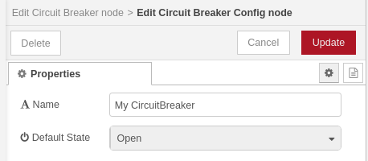
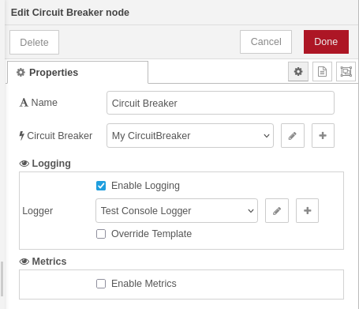
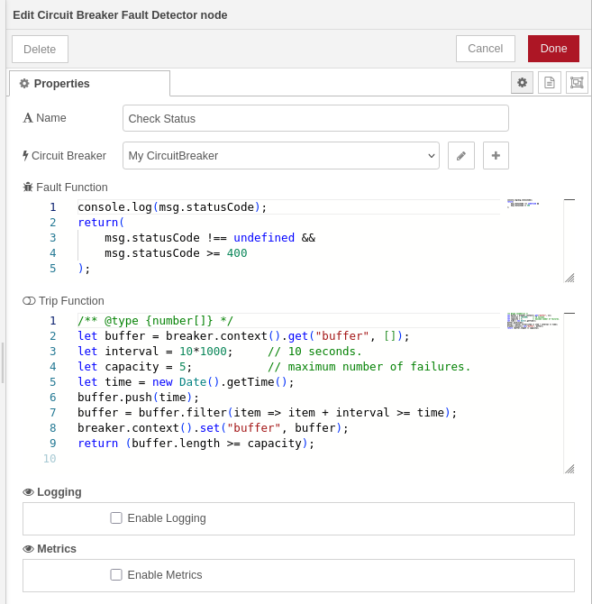
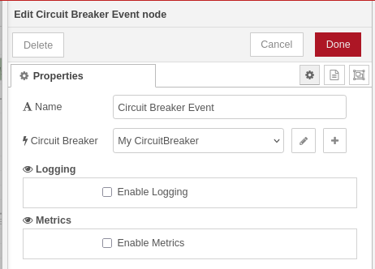
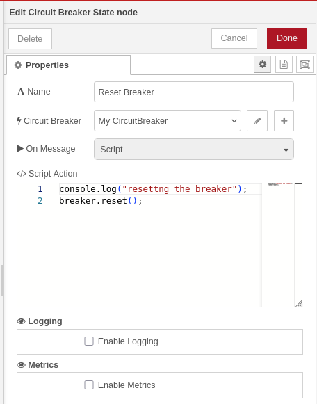
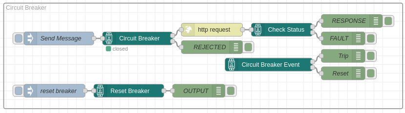

# @theotherwillembotha/node-red-circuitbreaker

Circuit Breaker nodes for Node-RED with configurable fault detection, trip conditions, and state management. Built on [@theotherwillembotha/node-red-plugincore](https://github.com/theotherwillembotha/nodered_plugincore).

---

## What is a Circuit Breaker?

A circuit breaker is a resilience pattern that protects high-volume flows from cascading failures. When an external dependency (an HTTP endpoint, a database, a third-party service) starts failing, a circuit breaker can detect the fault, stop sending requests to the failing system, and give it time to recover, rather than hammering it with traffic and making the situation worse.

The breaker has two states:

- **Closed** - the system is healthy. Messages flow through normally.
- **Open** (tripped) - a fault threshold has been reached. Messages are diverted so they can be buffered, dropped, or handled gracefully until the system recovers.

Recovery is fully customisable. You can reset automatically after a timeout, send periodic probe messages to test recovery, or require a configurable number of consecutive successes before closing again.

---

## Installation

Either use the **Manage Palette** option in the Node-RED editor, or run the following in your Node-RED user directory (typically `~/.node-red`):

```bash
npm install @theotherwillembotha/node-red-circuitbreaker
```

---

## Nodes

### Circuit Breaker Config

Shared state node that holds the breaker's open/closed state and context store. Every other node in this plugin must reference a config node. Multiple breaker nodes can share the same config node; if one of several integrations with a system detects a fault, all of them can trip together.

| Field         | Description |
|---------------|-------------|
| Name          | A descriptive label for this breaker instance. |
| Default State | The state the breaker starts in on deployment. **Closed** (default) - messages flow normally. **Open** - the breaker starts tripped. |

The config node also holds a **BreakerContext** - a key/value store accessible from Fault Detector and State scripts, useful for maintaining rolling windows or counters across messages.



---

### Circuit Breaker

Routes incoming messages based on the current breaker state. Place this node before any integration that may fail.

| Output | When | Description |
|--------|------|-------------|
| 1 - Closed | Breaker is closed (healthy) | Message is forwarded for normal processing |
| 2 - Open   | Breaker is tripped          | Message is diverted for buffering or error handling |

The node displays a **green dot** when closed and a **red dot** when open, updating automatically on state changes.



---

### Circuit Breaker Fault Detector

Inspects messages for fault conditions and decides whether to trip the breaker. Place this node after the integration you are protecting - typically after an HTTP request node.

| Output | When | Description |
|--------|------|-------------|
| 1 - Output | No fault detected | Message forwarded normally |
| 2 - Fault  | Fault detected    | Message forwarded for error handling |

#### Fault function

Called on every message that passes through this node. Return `true` if the message represents a failure, or `false` if it is healthy. This is where you define what "failure" means for your integration - a bad HTTP status code, a missing property, an error flag set upstream, and so on.

When the fault function returns `true`, the message is routed to the **fault** output and the trip function is evaluated. When it returns `false`, the message is considered successful and routed to the normal **output**.

```javascript
// Trip if the HTTP response was an error
return msg.statusCode !== undefined && msg.statusCode >= 400;
```

#### Trip function

Called only when the fault function returns `true`. Return `true` to trip the breaker immediately, or `false` to record the fault but leave the breaker closed.

This is where you implement your threshold or windowing strategy. You rarely want to trip on a single fault - instead you accumulate faults over a rolling time window and trip only when enough failures occur within that period. The breaker's context store persists between messages, making it ideal for tracking this state.

The example below trips the breaker once 5 faults occur within a 10-second window. Each call adds the current timestamp to a buffer, discards entries outside the window, saves the buffer back, then checks whether the count has hit the threshold:

```javascript
let buffer = breaker.context().get("buffer", []);
let interval = 10 * 1000; // sliding window of 10 seconds
let capacity = 5;         // trip after 5 faults within the window
let now = new Date().getTime();

buffer.push(now);
buffer = buffer.filter(t => t + interval >= now); // discard entries outside the window
breaker.context().set("buffer", buffer);

return buffer.length >= capacity; // true = trip the breaker
```



---

### Circuit Breaker Event

Fires a message whenever the breaker changes state. No input required - use this node to trigger notifications, update dashboards, or start recovery flows.

| Output | Fires when | Message |
|--------|-----------|---------|
| 1 - Trip  | Breaker is tripped | `{ state: "Trip" }`  |
| 2 - Reset | Breaker is reset   | `{ state: "Reset" }` |



---

### Circuit Breaker State

Manually controls the breaker state when a message arrives. Use this node to build recovery flows, health-check driven resets, or manual override controls.

| Action | Description |
|--------|-------------|
| **Reset**  | Closes the breaker - messages flow through Circuit Breaker nodes normally again. |
| **Trip**   | Opens the breaker - messages are diverted to the open output of Circuit Breaker nodes. |
| **Script** | Runs a custom script with access to the full breaker API and the incoming message. |

#### Script action

The script receives `(breaker, message)`. Use it for conditional or gradual recovery logic:

```javascript
// Reset only if the breaker has been open for at least 30 seconds
let trippedAt = breaker.context().get("trippedAt", 0);
if (new Date().getTime() - trippedAt > 30000) {
    breaker.reset();
}
```

The message is forwarded on the output after the action has been applied.



---

## Typical flow

```
[Inject] → [Circuit Breaker] → closed → [HTTP Request] → [Fault Detector] → output → [Process Response]
                             ↓ open                                        ↓ fault
                        [Buffer / Drop]                               [Log / Notify]

[Circuit Breaker Event] → trip  → [Notify / Start recovery timer]
                        → reset → [Resume buffered messages]

[Recovery probe / Inject] → [Circuit Breaker State: Reset]
```

---

## Integration with node-red-plugincore

All action nodes (Circuit Breaker, Fault Detector, Event, State) support the `LoggerTemplate` and `MetricsTemplate` from [@theotherwillembotha/node-red-plugincore](https://github.com/theotherwillembotha/nodered_plugincore):

- **Logging** - attach a Console, REST, or Loki logger config node to capture structured logs from each node.
- **Metrics** - enable Prometheus counters that track message throughput, trip counts, and reset counts per node instance.

---

## Example flow



On deployment, the circuit breaker initialises in the state configured on the Circuit Breaker Config node. While the breaker is closed, the Circuit Breaker node forwards messages to its closed output — in this example, an inject node drives a periodic HTTP request to an intentionally invalid URL that returns a 404. The response is fed into the Fault Detector node, which evaluates the HTTP status code to determine whether a fault occurred. When a fault is detected, the trip function checks whether the threshold has been exceeded: it maintains a rolling buffer of failure timestamps and trips the breaker if five or more faults occur within a 10-second window.

Once the breaker trips open, the Circuit Breaker node diverts subsequent messages to its open output rather than forwarding them to the HTTP request. At the same moment, the Circuit Breaker Event node fires and emits a message on its **Trip** output, which can be used to trigger a notification or start a recovery flow.

A manual **Reset** button is included in the flow. Pressing it sends a message into the Circuit Breaker State node, which is configured with a Script action that calls `breaker.reset()`. The same node can equally be set to **Reset** or **Trip** directly, without a script, for simpler override controls.

---

## References

- [node-red-plugincore](https://github.com/theotherwillembotha/nodered_plugincore)
- [Circuit Breaker pattern - Martin Fowler](https://martinfowler.com/bliki/CircuitBreaker.html)

## License

[ISC](LICENSE)
